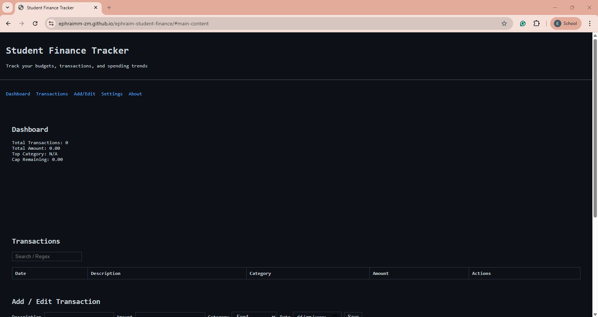

# Student Finance Tracker



## Table of Contents

1. [Project Overview](#project-overview)  
2. [Features](#features)  
3. [Regex Catalog](#regex-catalog)  
4. [Keyboard Navigation Map](#keyboard-navigation-map)  
5. [Accessibility Notes](#accessibility-notes)  
6. [Installation & Running](#installation--running)  
7. [Testing](#testing)  
8. [Demo Video](#demo-video)  
9. [License](#license)  

---

## Project Overview

**Student Finance Tracker** is a web application for tracking student spending and budgets. Users can:

- Add, edit, and delete financial transactions  
- View dashboard stats including totals, top categories, and remaining cap  
- Search using live regex patterns with highlighted matches  
- Import and export transaction data via JSON  
- Set monthly spending caps and switch currency  

The app is **fully accessible**, mobile-first, and styled in a Vim/cmd-inspired high-contrast theme.

---

## Features

### Core

- Add, Edit, Delete transactions  
- Dashboard: total transactions, total amount, top category, cap remaining  
- Live regex search with inline highlights  
- Monthly cap tracking with ARIA live announcements  
- Responsive design across mobile, tablet, and desktop  

### Settings

- Set monthly cap (numeric)  
- Choose currency: ZMW, USD, EUR  
- Settings persist via `localStorage`  

### Import/Export

- Import JSON file with validation  
- Export current transactions to JSON  

### Accessibility

- Skip-to-content link  
- Proper ARIA live regions for errors and status  
- Fully keyboard navigable  
- Semantic HTML: header, nav, main, section, footer  
- Focus-visible styles  

---

## Regex Catalog

| Field | Pattern | Description |
|-------|---------|-------------|
| Description | `/^\S(?:.*\S)?$/` | No leading/trailing spaces |
| Amount | `/^(0|[1-9]\d*)(\.\d{1,2})?$/` | Valid numeric amount, max 2 decimals |
| Category | `/^[A-Za-z]+(?:[ -][A-Za-z]+)*$/` | Letters, spaces, hyphens |
| Date | `/^\d{4}-(0[1-9]|1[0-2])-(0[1-9]|[12]\d|3[01])$/` | YYYY-MM-DD format |
| Advanced | `/\b(\w+)\s+\1\b/` | Detect duplicate words in description |

**Example:** Searching `coffee` will highlight any transaction with "coffee" in description or category.

---

## Keyboard Navigation Map

| Key / Action | Behavior |
|--------------|----------|
| Tab | Move between form inputs and buttons |
| Shift + Tab | Move backward through focusable elements |
| Enter | Submit focused form button |
| Arrow keys | Navigate table cells (if extended) |
| Skip link (`Skip to content`) | Jump to main content directly |

---

## Accessibility Notes

- All input errors are announced via `aria-live="polite"`  
- Cap alerts use `aria-live="assertive"` when exceeded  
- Focus styles clearly visible  
- Semantic headings & landmarks for screen readers  
- All interactive elements reachable by keyboard  

---

## Installation & Running

1. Clone repository:

```bash
git clone https://github.com/ephraimm-zm/ephraim-student-finance.git
cd student-finance-tracker
```

2. Serve locally (recommended via VS Code Live Server or Python HTTP server):

```bash
# Python 3
python -m http.server 5500
```

3. Open browser: `http://localhost:5500`

4. Or access live via GitHub Pages:  
`https://ephraimm-zm.github.io/ephraim-student-finance/`

---

## Testing

1. **Form Validation**:  
   - Enter invalid description/amount/category/date to test error messages.
2. **Add/Edit/Delete Transactions**:  
   - Add a transaction → verify it appears in table and dashboard updates.  
   - Edit a transaction → changes reflect immediately.  
   - Delete a transaction → removed from table and dashboard.
3. **Live Search**:  
   - Type regex patterns (e.g., `/\b(\w+)\s+\1\b/`) in the search bar → matches highlighted.
4. **Settings**:  
   - Change cap or currency → check dashboard updates accordingly.  
   - Refresh page → settings persist.
5. **JSON Import/Export**:  
   - Export transactions → JSON file downloads.  
   - Import JSON → transactions added to table, errors handled.

---

## Demo Video

[Unlisted YouTube Video](https://youtu.be/your-demo-link)  
Shows:

- Keyboard navigation  
- Regex edge cases  
- Import/Export functionality  
- Responsive layouts  

---

## License

MIT License © 2025 Ephraim Mulilo
